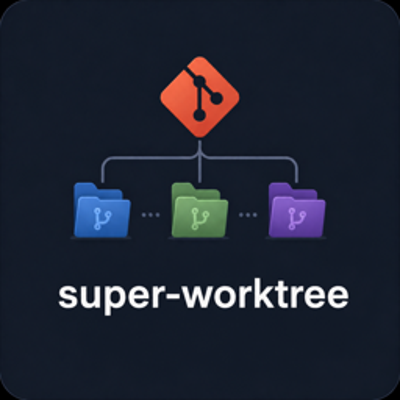

# super-worktree



Create isolated git worktrees for parallel feature work with monorepo-aware env file copying and node_modules symlinking.

## Installation

```bash
npx skills add marioxe301/super-worktree
```

Works with Claude Code, OpenCode, Codex, Cursor, Windsurf, Cline, and 40+ AI agents.

## Requirements

- Git 2.5+ (with worktree support)
- Bash 4.0+
- `jq` - Optional, for JSON config parsing (Python 3 fallback available)
- `python3` - Optional, fallback JSON parser

## Features

### Automatic sensitive file copying

Automatically copies environment files and credentials to new worktrees:

- `.env`, `.env.*` - Environment files
- `.envrc` - direnv config
- `.local.*` - Local overrides
- `credentials.json`, `credentials.yml` - Credentials
- `auth.json`, `auth.yml` - Auth config

### node_modules symlinking

Saves disk space by symlinking dependencies instead of copying.

### Auto-navigation

Automatically spawns terminals with OpenCode running in the new worktree:

- **After create**: Opens new terminal in worktree
- **After delete**: Opens new terminal in base branch
- Base branch is stored in `.worktrees/.metadata/`

#### Supported Terminals

| Terminal    | Platform   | Priority |
| ----------- | ---------- | -------- |
| cmux        | All        | 1 (if CMUX_WORKSPACE_ID set) |
| tmux        | All       | 2        |
| Warp        | macOS     | 3        |
| Kitty       | Linux/macOS | 4      |
| Ghostty     | macOS/Linux | 5      |
| Alacritty   | All       | 6        |
| WezTerm     | All       | 7        |
| GNOME Terminal | Linux  | 8        |
| iTerm2      | macOS     | 9 (fallback) |

Note: If no supported terminal is found, print instructions to manually run `cd <worktree> && opencode`.

### Configurable patterns

Override defaults with a `super-worktree.json` file:

```json
{
  "sync": {
    "copyFiles": [".env", ".env.local"],
    "symlinkDirs": ["node_modules", ".pnpm-store"],
    "exclude": ["dist", "build"]
  }
}
```

## Commands

| Command                           | Description               |
| --------------------------------- | ------------------------- |
| `create <branch> [from-branch]`     | Create new worktree       |
| `create <branch> --config <file>`  | Create with custom config |
| `delete <branch>`                 | Remove worktree           |
| `merge <branch>`                  | Merge and cleanup         |

## Examples

```bash
# Create from main
bash scripts/worktree-manager.sh create feature/new-login

# Create from develop
bash scripts/worktree-manager.sh create feature/payments develop

# Delete worktree
bash scripts/worktree-manager.sh delete feature/new-login

# Merge and cleanup
bash scripts/worktree-manager.sh merge feature/new-login
```

## Configuration Priority

Config is loaded in this order (later overrides earlier):

1. Built-in defaults
2. Global config: `~/.config/super-worktree/config.json`
3. Project config: `.super-worktree.json`
4. CLI `--config` flag (highest)

## License

MIT